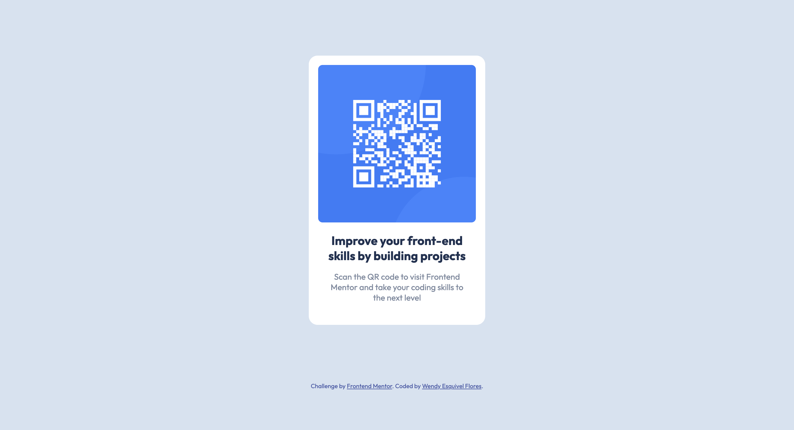

# Frontend Mentor - QR code component solution

This is a solution to the [QR code component challenge on Frontend Mentor](https://www.frontendmentor.io/challenges/qr-code-component-iux_sIO_H). Frontend Mentor challenges help you improve your coding skills by building realistic projects. 

## Table of contents

- [Overview](#overview)
  - [Screenshot](#screenshot)
  - [Links](#links)
- [My process](#my-process)
  - [Built with](#built-with)
  - [What I learned](#what-i-learned)
  - [Continued development](#continued-development)
  - [Useful resources](#useful-resources)
- [Author](#author)
- [Acknowledgments](#acknowledgments)

## Overview

### Screenshot

## My process

### Built with

- Semantic HTML5 markup
- CSS custom properties
- Flexbox

### What I learned

Did this mini challenge to refresh my knowledge about HTML and CSS. In the process, I Learned how CSS flexbox works and its different propierties. Also learnded about the diferencess between Flexbox and Grid.

### Continued development

I would like to work on my CSS and UI skills to make my projects more appealing to users. For future projects I would like to integrate more JS and practice some animations to keep it fun!

### Useful resources

- [Flexbox CSS: Guia Completo, Elementos y Ejemplos](https://www.aluracursos.com/blog/flexbox-css-guia-completo-elementos-y-ejemplos) - This helped me for to understand Flexbox and all its properties and behaviors.

- [Relación de Grid Layout con otros métodos de diseño y posicionamiento - CSS](https://developer.mozilla.org/es/docs/Web/CSS/CSS_Grid_Layout/Relationship_of_Grid_Layout) - This Grid post help me to understand Grid and the differences that it has with Flexbox.

## Author

- LinkedIn - [Wendy Esquivel Flores](https://www.linkedin.com/in/wendy-esquivel-flores-1a6565187/)
- Frontend Mentor - [@itswendyef](https://www.frontendmentor.io/profile/itswendyef)
